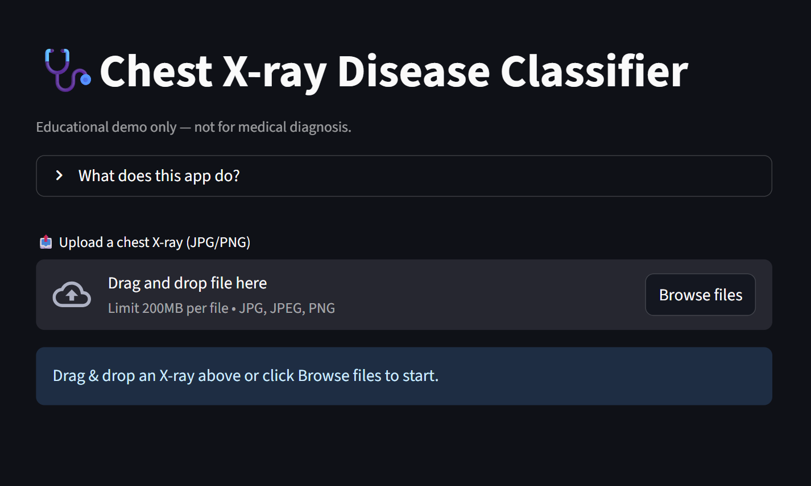
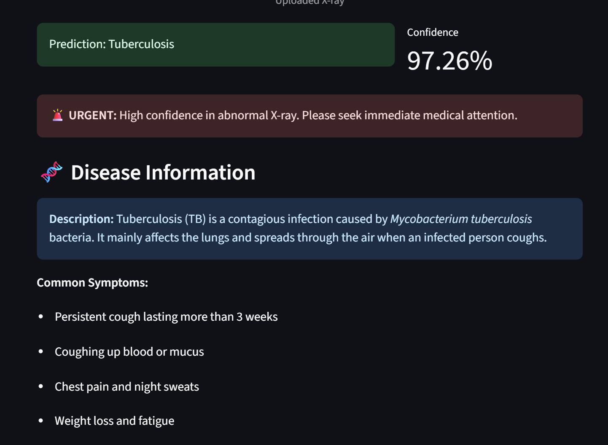
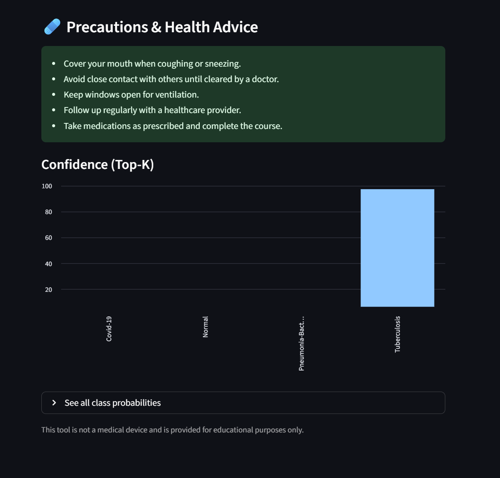

# Chest X-Ray Diagonosis

## Table of Contents
- [Introduction](#abstract) <br>
- [Reqirements](#requirements) <br>
- [How to Use](#how-to-use) <br>
- [Preview](#preview) <br>
- [Contribution](#contribution) <br>
- [Improvements](#improvements) <br>

## Abstract
This project focuses on building a model that diagnoses chest diseases from chest X-ray images.To develop a deep learning–based model capable of classifying chest X-ray images into multiple disease categories (such as COVID-19, Pneumonia, and Tuberculosis) to assist in automated and accurate diagnosis.The project implements convolutional neural network (CNN) with the help of a pre-trained model DenseNet121 to analyze chest X-Rays.


## Requirements 
<table>
  <tr>
    <th>Package</th>
    <th>Version</th>
  </tr>
  <tr>
    <td>tensorflow</td>
    <td>2.12.0</td>
  </tr>
  <tr>
    <td>keras     </td>
    <td>2.12.0</td>
  </tr>
  <tr>
    <td>scikit-learn</td>
    <td>1.3.0</td>
  </tr>
  <tr>
    <td>numpy         </td>
    <td>1.23.0</td>
  </tr>
  <tr>
    <td>streamlit      </td>
    <td>1.30.0</td>
  </tr>
  <tr>
    <td>matplotlib        </td>
    <td>3.7.0</td>
  </tr>
  <tr>
    <td>pandas   </td>
    <td>1.5.0</td>
  </tr>
</table>


## How to Use
Follow these steps to run the project:  
Clone:
```terminal
git clone https://github.com/AAC-Open-Source-Pool/25AACR12
```
Install the required Libraries:
```terminal
pip install -r requirements.txt
```
Run the Classifier Script:
```terminal
python chest_xray_classifier.py
```
## Preview

<div style="display: flex; align-items: center;">
  
  
  
  
</div>

## Team Details
<b>Team Number:</b>  
25AACR12    
  
<b>Senior Mentor:</b>  
S.Rahul    
  
<b>Junior Mentor:</b>  
C.Srakshin    
  
<b>Team Member 1:</b>  
Sai Sudhamsh Chivukula
  
<b>Team Member 2:</b>  
Meghana Alluri
  
<b>Team Member 3:</b>  
Divya Lahari Kappagantula
  
## Contribution 
**This section provides instructions and details on how to submit a contribution via a pull request. It is important to follow these guidelines to make sure your pull request is accepted.**
1. Before choosing to propose changes to this project, it is advisable to go through the readme.md file of the project to get the philosophy and the motive that went behind this project. The pull request should align with the philosophy and the motive of the original poster of this project.
2. To add your changes, make sure that the programming language in which you are proposing the changes should be the same as the programming language that has been used in the project. The versions of the programming language and the libraries(if any) used should also match with the original code.
3. Write a documentation on the changes that you are proposing. The documentation should include the problems you have noticed in the code(if any), the changes you would like to propose, the reason for these changes, and sample test cases. Remember that the topics in the documentation are strictly not limited to the topics aforementioned, but are just an inclusion.
4. Submit a pull request via [Git etiquettes](https://gist.github.com/mikepea/863f63d6e37281e329f8)

## Improvements
While the current model performs effectively, several improvements can further enhance its accuracy, interpretability, and usability:

1. **Model Enhancement:**  
   Implement and compare advanced architectures like **ResNet50**, **EfficientNet**, or **Vision Transformers (ViT)** to achieve higher diagnostic precision.  

2. **Explainability and Visualization:**  
   Integrate **Grad-CAM** or **LIME** visualizations to highlight critical regions in the X-ray image influencing the model’s predictions.  

3. **Dataset Expansion:**  
   Incorporate larger and more diverse datasets to reduce class imbalance and improve generalization across different imaging conditions.  

4. **Performance Optimization:**  
   Utilize **model quantization**, **mixed precision training**, or **GPU acceleration** to reduce inference time and memory consumption.  

5. **User Interface and Accessibility:**  
   Enhance the Streamlit interface with interactive reports, confidence scores, and patient data integration.  
   Enable **cloud deployment** (e.g., Streamlit Cloud, AWS, or GCP) for broader accessibility.  
