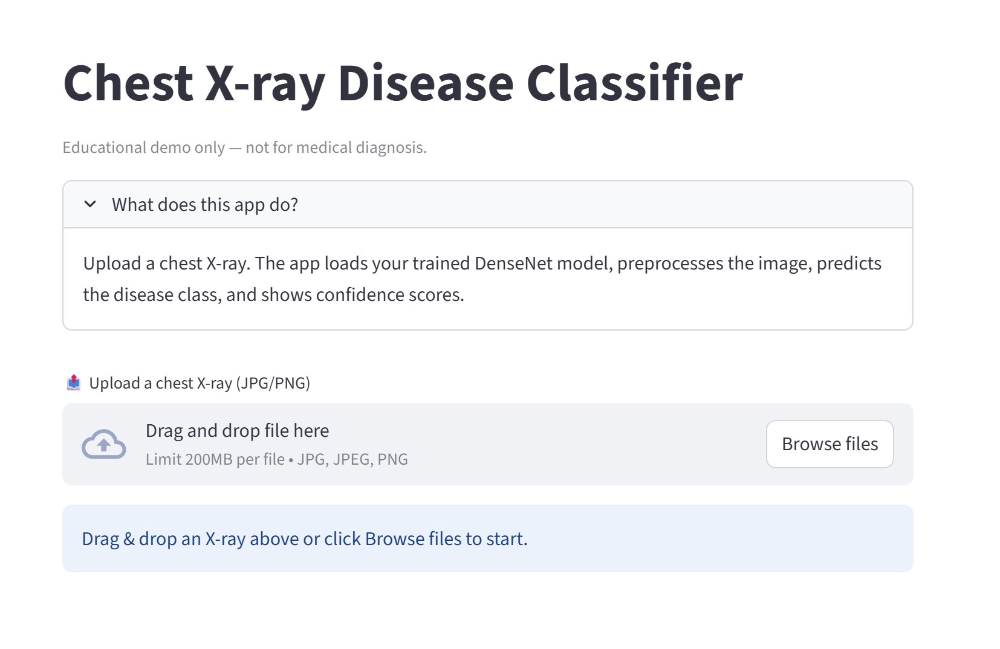
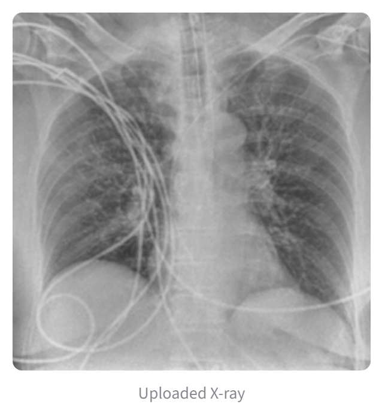
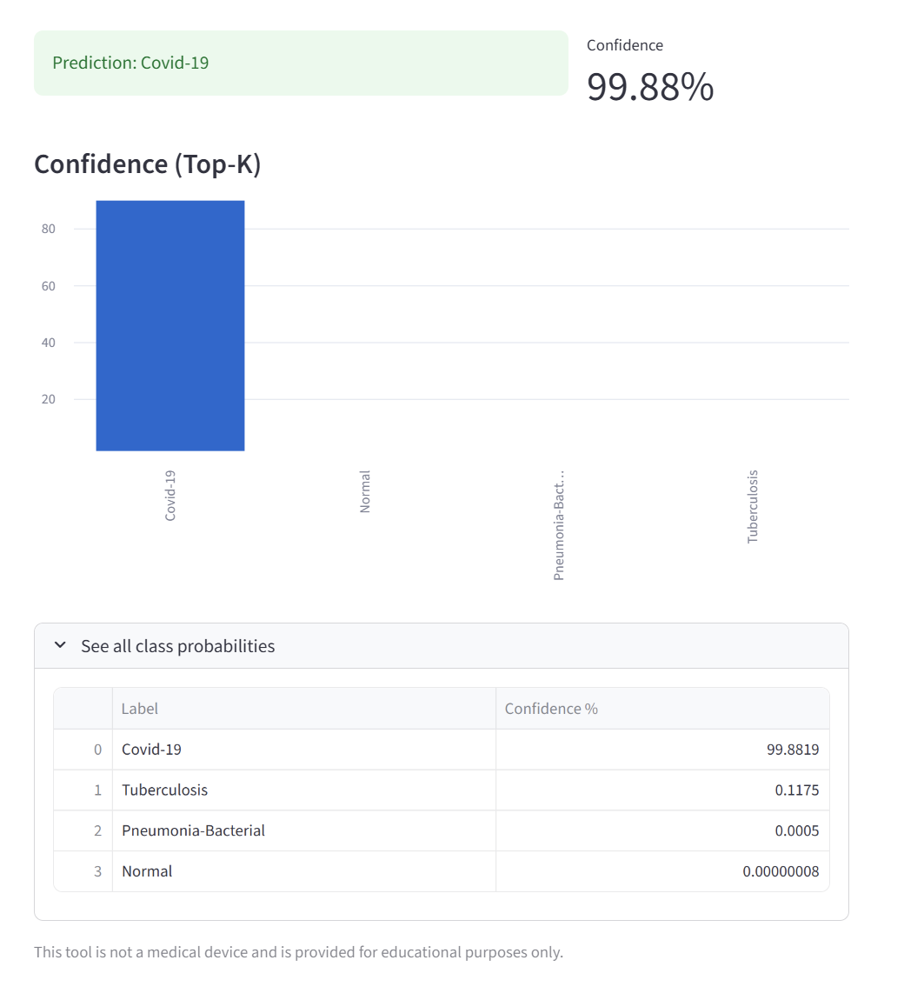

# Chest X-Ray Diagonosis
## Team Details
<b>Team Number:</b>  
25AACR12    
  
<b>Senior Mentor:</b>  
S.Rahul    
  
<b>Junior Mentor:</b>  
C.Srakshin    
  
<b>Team Member 1:</b>  
Sai Sudhamsh Chivukula
  
<b>Team Member 2:</b>  
Meghana Alluri
  
<b>Team Member 3:</b>  
Divya Lahari Kappagantula
  
<b>Team Member 4:</b>  
 Sankarshan
  
<b>Team Member 5:</b>  
Sai Teja
  
## Table of Contents
- [Introduction](#introduction) <br>
- [Reqirements](#requirements) <br>
- [How to Use](#How-to-use) <br>
- [Preview](#preview) <br>
- [Contribution](#contribution) <br>
## Introduction
This project focuses on building a model that diagnoses chest diseases from chest X-ray images.To develop a deep learning–based model capable of classifying chest X-ray images into multiple disease categories (such as COVID-19, Pneumonia, and Emphysema) to assist in automated and accurate diagnosis.The project implements convolutional neural network (CNN) with the help of a pre-trained model DenseNet121 to analyze chest X-Rays.
## Requirements
<pre>
  Package            Version
------------------ -----------
  tensorflow          2.12.0
  keras               2.12.0
  scikit-learn        1.3.0
  numpy               1.23.0
  pandas              1.5.0
  pillow              9.5.0
  streamlit           1.30.0
  matplotlib          3.7.0
  h5py                3.8.0
</pre>
## How to Use
Follow these steps to run the project:  
Clone:
```terminal
git clone https://github.com/AAC-Open-Source-Pool/25AACR12
```
Install the required Libraries:
```terminal
pip install -r requirements.txt
```
Run the Classifier Script:
```terminal
python chest_xray_classifier.py
```
## Preview
<p>Below is an example of Chest X-Ray Diagnosis:</p>
<div style="display: flex; align-items: center;">
  
  
  
</div>
<h2>Contribution</h2>
1. Understand the project: Read the README to align your changes with the project’s philosophy and goals.<br><br>
2. Use the same technology: Ensure your changes use the same programming language, version, and libraries as the original project.<br><br>
3. Document your changes: Include the issues you found, proposed changes, reasons for them, and sample test cases.<br><br>
4. Submit a Pull Request: Follow standard Git etiquette for submitting your contributions.
